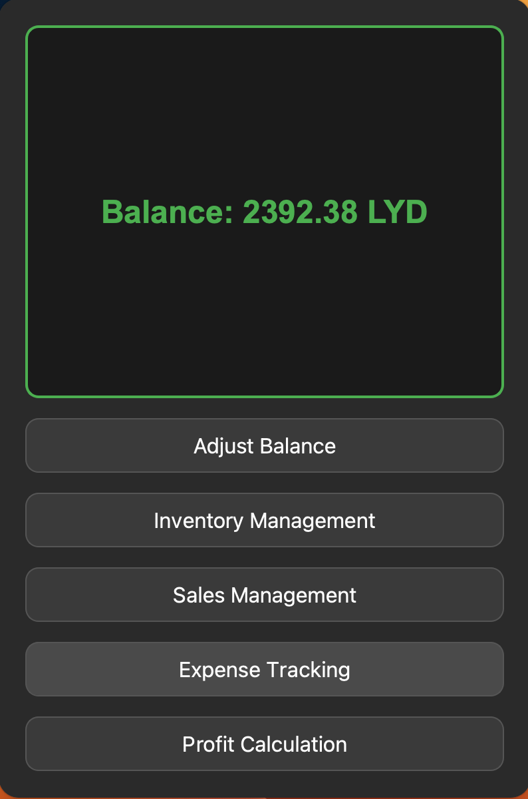

# PySalesManagement: Sales and Inventory Management System

PySalesManagement is a comprehensive sales and inventory management system designed to streamline and automate the crucial aspects of a business. It provides an intuitive and user-friendly interface for managing sales, expenses, inventory, and profit calculations, making it an ideal solution for small businesses.

## Features

- **Sales Management**: Keep track of sales transactions and generate detailed reports.
- **Inventory Management**: Manage your stock levels, product information, and reorder processes.
- **Expense Tracking**: Record and monitor business expenses to maintain financial health.
- **Profit Calculation**: Analyze profit margins with automated calculations based on sales and expenses.
- **MYSQL Database**: Leverages a robust MYSQL database to manage all data reliably.

## System Requirements

Before you begin, ensure you have the following requirements installed:

- Python 3.9 or later
- MYSQL Database Server

## Installation

To set up your local development environment, please follow the steps below:

1. Clone the repository to your local machine:

    ```bash
    git clone https://github.com/Ajelz/PySalesManagement.git
    cd PySalesManagement
    ```

2. Install the required dependencies:

    ```bash
    pip install -r requirements.txt
    ```

3. Initialize the database using the provided SQL script:

    ```bash
    mysql -u your_user -p your_database < database/init_db.sql
    ```

4. Configure your database connection by editing the `database/config.toml` file with your MYSQL credentials.

## Usage

Run `main.py` to launch the application:

```bash
python main.py
```

### System Windows

- **Main Window**: The central hub of the application where you can navigate to different functionalities.
  

- **Inventory Window**: Dedicated to managing product stock levels, with features to add, edit, and delete inventory items.
  

- **Sales Window**: Focuses on the creation and management of sales records and transactions.
  

- **Expense Window**: Allows for the tracking and managing of business expenses.
  

- **Profit Window**: Calculates and displays profit based on income from sales and outgoing expenses.
  

## Contributing

Contributions to improve PySalesManagement are welcome. Feel free to fork the repository and submit pull requests.

## License

This project is licensed under the [MIT License](LICENSE).
